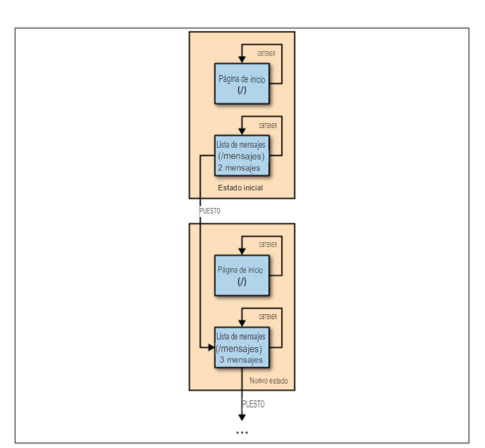

###### Figura 1-8. La aventura de Alice: la perspectiva del servidor

El servidor gestiona dos recursos: la página de inicio (servida desde `/`) y la lista de mensajes (servida desde `/messages`). (El servidor también gestiona un recurso para cada mensaje individual. He omitido esos recursos del diagrama por simplicidad.) El estado de estos recursos se llama, simplemente, *estado del recurso*.

Cuando la historia comienza, hay dos mensajes en la lista de mensajes: "Hello" y "Later". Enviar un GET a la página de inicio no cambia el estado del recurso, ya que la página de inicio es un documento estático que nunca cambia. Enviar un GET a la lista de mensajes tampoco cambiará el estado.

Pero cuando Alice envía un POST a la lista de mensajes, pone al servidor en un nuevo estado. Ahora la lista de mensajes contiene tres mensajes: "Hello", "Later" y "Test". No hay forma de volver al estado anterior, pero este nuevo estado es muy similar. Como antes, enviar un GET a la página de inicio o a la lista de mensajes no cambiará nada. Pero enviar otro POST a la lista de mensajes agregará un cuarto mensaje a la lista.

###### 12 | Capítulo 1: Navegando por la Web

